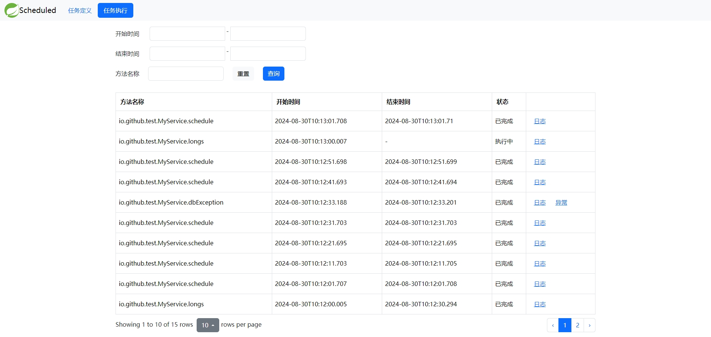
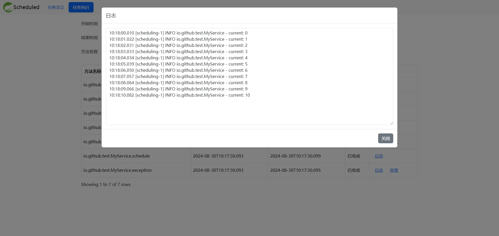

:toc:
= actuator-scheduledtask-spring-boot-starter

== 简介

Spring Framework提供的 `@Scheduled` 注解是Java应用中广泛使用的调度任务实现方案，相比于Quartz和xxl-job等调度框架，它的使用方式非常简单，
这种简单性确实给调度任务的开发带来诸多便利，但也导致后期的运维监控的困难，通常只能在冗长的日志内容中苦苦寻找调度任务的执行记录和结果

`actuator-scheduledtask-spring-boot-starter` 正是为了弥补 `@Scheduled` 这一缺陷而开发的，它会记录调度任务每一次的执行情况包括执行的开始结束时间、
执行过程中的日志和产生的异常信息，此外还提供了美观的页面查看这些内容，使开发或运维人员轻松管理众多的调度任务

== 功能说明

=== 任务定义

image::images/definition.png[]

任务定义页面展示项目中所有使用 `@Scheduled` 注解声明的调度任务和调度配置，根据注解的配置将任务分为 `FIXED_RATE`、`FIXED_DELAY` 和 `CRON` 这几个类型，
还支持手动执行和取消调度

=== 任务执行

任务执行页面展示每个调度任务的执行记录，还支持查看执行产生的日志和异常，包括执行中的任务也可以实时查看日志，如果最后一列只有 `日志` 按钮则代表本次执行没有异常

== 使用方法

=== 要求

* Spring Boot 2.x
* Spring Boot Web
* Spring Boot Actuator
* Logback
* `@Scheduled` 注解方法非private非final

=== 安装配置

首先在Spring Boot项目的 `pom.xml` 中添加 `actuator-scheduledtask-spring-boot-starter` 依赖和
它依赖的 `actuator` 依赖，如果项目中已经添加过 `actuator` 则不必重复添加

[source,xml,subs="verbatim"]
----
<dependencies>
        <dependency>
            <groupId>io.github.pxzxj</groupId>
            <artifactId>actuator-scheduledtask-spring-boot-starter</artifactId>
            <version>2.0</version>
        </dependency>
        <dependency>
            <groupId>org.springframework.boot</groupId>
            <artifactId>spring-boot-starter-actuator</artifactId>
        </dependency>
</dependencies>
----

下一步在 `application.yml` 中添加如下的配置开放Actuator的调度任务相关接口，如果项目中已有 `management.endpoints.web.exposure.include="*"` 的配置则无需再重复添加

[source,yaml,subs="verbatim"]
----
management:
  endpoints:
    web:
      exposure:
        include:
          - scheduledtaskdefinitions
          - scheduledtaskdefinitions-id
          - scheduledtaskexecutions
          - scheduledtaskexecutions-id
----

WARNING: 开放Actuator的相关接口会带来安全问题，可以根据项目使用的安全框架进行配置仅允许授权请求访问，也可以参考 https://docs.spring.io/spring-boot/docs/2.7.11/reference/htmlsingle/#actuator.endpoints.security[Spring Boot官方文档]进一步了解

下一步启动项目访问 `/actuator/scheduledtask/index.html` 即可打开调度任务页面

=== 执行记录存储

`actuator-scheduledtask-spring-boot-starter` 会自动存储调度任务每一次的执行情况，可以通过 `management.scheduledtask.repository-type` 配置项修改存储方式，
默认支持内存和数据库两种方式对应 `memory` 和 `jdbc` 两个值，如果默认的存储方式不满足要求项目也可以扩展自己的存储实现

==== 内存

使用内存类型的存储时会把所有任务执行记录都存储在一个 `LinkedList` 中，可以通过 `management.scheduledtask.memory-size-limit` 配置项修改List的最大长度，
达到最大长度时继续新增会删除最早的执行记录，遵循FIFO策略，默认最大长度是10000

内存是推荐的存储方式，因为内存操作速度快而且都是本地调用更可靠，至于它只能存储最近的执行情况这一点并不是问题，
因为我们通常也只关注调度任务近期的执行情况，即使过去的某一次调度任务因为一些特殊原因执行失败，
但要最近的数十次都执行正常那么就可以认为此调度任务执行正常

使用内存存储的另一点值得关注的当然是对内存的占用，因为保存任务执行记录的 `LinkedList` 是常驻内存中不会清理的，如果它占用的内存过大势必影响其它代码的正常执行，下面对它的内存占用做详细分析

`LinkedList` 中保存的是如下 `ScheduledTaskExecution` 类的实例，可以看到它的 `id`、`methodName`、`startTime`、`endTime`、`state` 这些属性对内存的占用是基本确定的，主要的不确定性还是集中在 `log` 和 `exception` 上，
经过测试在 `log` 和 `exception` 都设置为 `null` 的情况下 `LinkedList` 中添加10000个 `ScheduledTaskExecution` 对象占用的堆内存也只不过10M左右基本上可以忽略，因而我们实际只需要考虑 `log` 和 `exception` 的大小即可，下面以一个实际的示例进行进一步的说明

[source,java,subs="verbatim"]
----
public class ScheduledTaskExecution {

    private Long id;

    private String methodName;

    private LocalDateTime startTime;

    private LocalDateTime endTime;

    private State state;

    private String log;

    private String exception;

    public enum State {

        EXECUTING, FINISHED

    }
}
----

`log` 和 `exception` 都是字符串并且都可以看作调度任务的输出，因此把它们合并进行考虑，通常一段主要由ascii字符构成文本内容在JVM中占用的内存约为文本大小的两倍(这一点与Java中String和Char的设计有关，读者可以自行查阅资料了解)，以下面的Spring Boot启动日志为例，把这段日志保存为txt文本的大小为7KB，那么它在JVM占用的大小就是14KB，10000个这样的字符串占用的JVM内存就是140MB，如果10000个 `ScheduledTaskExecution` 的 `log` 和 `exception` 内容平均有这么多，最终的 `LinkedList` 占用的堆内存大小也就是140MB

实际的调度任务的日志大小当然各不相同，建议根据实际项目情况以及下文对 <<log, 日志>> 的进一步介绍合理设置 `management.scheduledtask.memory-size-limit` 的值以保证任务执行记录不会占用过多内存同时也能保留足够多的记录数供页面查看

----
  .   ____          _            __ _ _
 /\\ / ___'_ __ _ _(_)_ __  __ _ \ \ \ \
( ( )\___ | '_ | '_| | '_ \/ _` | \ \ \ \
 \\/  ___)| |_)| | | | | || (_| |  ) ) ) )
  '  |____| .__|_| |_|_| |_\__, | / / / /
 =========|_|==============|___/=/_/_/_/
 :: Spring Boot ::               (v2.7.18)

2024-08-31 20:29:04.819  INFO 15004 --- [           main] com.MyApp                                : Starting MyApp using Java 1.8.0_241 on LAPTOP-3ERFP2SR with PID 15004 (C:\Users\86187\IdeaProjects\localweb\target\classes started by 86187 in C:\Users\86187\IdeaProjects\localweb)
2024-08-31 20:29:04.829  INFO 15004 --- [           main] com.MyApp                                : No active profile set, falling back to 1 default profile: "default"
2024-08-31 20:29:10.558  INFO 15004 --- [           main] o.s.b.w.embedded.tomcat.TomcatWebServer  : Tomcat initialized with port(s): 8080 (http)
2024-08-31 20:29:10.585  INFO 15004 --- [           main] o.apache.catalina.core.StandardService   : Starting service [Tomcat]
2024-08-31 20:29:10.585  INFO 15004 --- [           main] org.apache.catalina.core.StandardEngine  : Starting Servlet engine: [Apache Tomcat/9.0.83]
2024-08-31 20:29:10.982  INFO 15004 --- [           main] o.a.c.c.C.[Tomcat].[localhost].[/]       : Initializing Spring embedded WebApplicationContext
2024-08-31 20:29:10.982  INFO 15004 --- [           main] w.s.c.ServletWebServerApplicationContext : Root WebApplicationContext: initialization completed in 6047 ms
2024-08-31 20:29:12.486  INFO 15004 --- [           main] o.s.b.a.w.s.WelcomePageHandlerMapping    : Adding welcome page: class path resource [static/index.html]
2024-08-31 20:29:13.028  INFO 15004 --- [           main] o.s.b.a.e.web.EndpointLinksResolver      : Exposing 2 endpoint(s) beneath base path '/actuator'
2024-08-31 20:29:13.159  INFO 15004 --- [           main] o.s.b.w.embedded.tomcat.TomcatWebServer  : Tomcat started on port(s): 8080 (http) with context path ''
2024-08-31 20:29:13.195  INFO 15004 --- [           main] com.MyApp                                : Started MyApp in 9.077 seconds (JVM running for 9.917)
2024-08-31 20:29:13.209  INFO 15004 --- [   scheduling-1] com.qqq.MyService                        : myMethod1
2024-08-31 20:29:13.211  INFO 15004 --- [   scheduling-1] com.qqq.MyService                        : myMethod2
2024-08-31 20:29:13.220 ERROR 15004 --- [   scheduling-1] o.s.s.s.TaskUtils$LoggingErrorHandler    : Unexpected error occurred in scheduled task

java.lang.NullPointerException: null
	at com.qqq.MyService.myMethod2(MyService.java:20) ~[classes/:na]
	at com.qqq.MyService.myMethod1(MyService.java:16) ~[classes/:na]
	at sun.reflect.NativeMethodAccessorImpl.invoke0(Native Method) ~[na:1.8.0_241]
	at sun.reflect.NativeMethodAccessorImpl.invoke(NativeMethodAccessorImpl.java:62) ~[na:1.8.0_241]
	at sun.reflect.DelegatingMethodAccessorImpl.invoke(DelegatingMethodAccessorImpl.java:43) ~[na:1.8.0_241]
	at java.lang.reflect.Method.invoke(Method.java:498) ~[na:1.8.0_241]
	at org.springframework.aop.support.AopUtils.invokeJoinpointUsingReflection(AopUtils.java:344) ~[spring-aop-5.3.31.jar:5.3.31]
	at org.springframework.aop.framework.ReflectiveMethodInvocation.invokeJoinpoint(ReflectiveMethodInvocation.java:198) ~[spring-aop-5.3.31.jar:5.3.31]
	at org.springframework.aop.framework.CglibAopProxy$CglibMethodInvocation.invokeJoinpoint(CglibAopProxy.java:798) ~[spring-aop-5.3.31.jar:5.3.31]
	at org.springframework.aop.framework.ReflectiveMethodInvocation.proceed(ReflectiveMethodInvocation.java:163) ~[spring-aop-5.3.31.jar:5.3.31]
	at org.springframework.aop.framework.CglibAopProxy$CglibMethodInvocation.proceed(CglibAopProxy.java:762) ~[spring-aop-5.3.31.jar:5.3.31]
	at org.springframework.aop.aspectj.MethodInvocationProceedingJoinPoint.proceed(MethodInvocationProceedingJoinPoint.java:89) ~[spring-aop-5.3.31.jar:5.3.31]
	at io.github.pxzxj.actuator.scheduledtask.ScheduledTaskAspect.logAround(ScheduledTaskAspect.java:70) ~[actuator-scheduledtask-spring-boot-starter-2.0.jar:na]
	at sun.reflect.NativeMethodAccessorImpl.invoke0(Native Method) ~[na:1.8.0_241]
	at sun.reflect.NativeMethodAccessorImpl.invoke(NativeMethodAccessorImpl.java:62) ~[na:1.8.0_241]
	at sun.reflect.DelegatingMethodAccessorImpl.invoke(DelegatingMethodAccessorImpl.java:43) ~[na:1.8.0_241]
	at java.lang.reflect.Method.invoke(Method.java:498) ~[na:1.8.0_241]
	at org.springframework.aop.aspectj.AbstractAspectJAdvice.invokeAdviceMethodWithGivenArgs(AbstractAspectJAdvice.java:634) ~[spring-aop-5.3.31.jar:5.3.31]
	at org.springframework.aop.aspectj.AbstractAspectJAdvice.invokeAdviceMethod(AbstractAspectJAdvice.java:624) ~[spring-aop-5.3.31.jar:5.3.31]
	at org.springframework.aop.aspectj.AspectJAroundAdvice.invoke(AspectJAroundAdvice.java:72) ~[spring-aop-5.3.31.jar:5.3.31]
	at org.springframework.aop.framework.ReflectiveMethodInvocation.proceed(ReflectiveMethodInvocation.java:175) ~[spring-aop-5.3.31.jar:5.3.31]
	at org.springframework.aop.framework.CglibAopProxy$CglibMethodInvocation.proceed(CglibAopProxy.java:762) ~[spring-aop-5.3.31.jar:5.3.31]
	at org.springframework.aop.interceptor.ExposeInvocationInterceptor.invoke(ExposeInvocationInterceptor.java:97) ~[spring-aop-5.3.31.jar:5.3.31]
	at org.springframework.aop.framework.ReflectiveMethodInvocation.proceed(ReflectiveMethodInvocation.java:186) ~[spring-aop-5.3.31.jar:5.3.31]
	at org.springframework.aop.framework.CglibAopProxy$CglibMethodInvocation.proceed(CglibAopProxy.java:762) ~[spring-aop-5.3.31.jar:5.3.31]
	at org.springframework.aop.framework.CglibAopProxy$DynamicAdvisedInterceptor.intercept(CglibAopProxy.java:707) ~[spring-aop-5.3.31.jar:5.3.31]
	at com.qqq.MyService$$EnhancerBySpringCGLIB$$22958a4e.myMethod1(<generated>) ~[classes/:na]
	at sun.reflect.NativeMethodAccessorImpl.invoke0(Native Method) ~[na:1.8.0_241]
	at sun.reflect.NativeMethodAccessorImpl.invoke(NativeMethodAccessorImpl.java:62) ~[na:1.8.0_241]
	at sun.reflect.DelegatingMethodAccessorImpl.invoke(DelegatingMethodAccessorImpl.java:43) ~[na:1.8.0_241]
	at java.lang.reflect.Method.invoke(Method.java:498) ~[na:1.8.0_241]
	at org.springframework.scheduling.support.ScheduledMethodRunnable.run(ScheduledMethodRunnable.java:84) ~[spring-context-5.3.31.jar:5.3.31]
	at org.springframework.scheduling.support.DelegatingErrorHandlingRunnable.run(DelegatingErrorHandlingRunnable.java:54) ~[spring-context-5.3.31.jar:5.3.31]
	at java.util.concurrent.Executors$RunnableAdapter.call(Executors.java:511) [na:1.8.0_241]
	at java.util.concurrent.FutureTask.runAndReset(FutureTask.java:308) [na:1.8.0_241]
	at java.util.concurrent.ScheduledThreadPoolExecutor$ScheduledFutureTask.access$301(ScheduledThreadPoolExecutor.java:180) [na:1.8.0_241]
	at java.util.concurrent.ScheduledThreadPoolExecutor$ScheduledFutureTask.run(ScheduledThreadPoolExecutor.java:294) [na:1.8.0_241]
	at java.util.concurrent.ThreadPoolExecutor.runWorker(ThreadPoolExecutor.java:1149) [na:1.8.0_241]
	at java.util.concurrent.ThreadPoolExecutor$Worker.run(ThreadPoolExecutor.java:624) [na:1.8.0_241]
	at java.lang.Thread.run(Thread.java:748) [na:1.8.0_241]
----

==== 数据库

使用数据库存储会把任务执行记录保存到一张表中，默认的表名是 `scheduledtask_execution`，
可以通过 `management.scheduledtask.jdbc-table-name` 配置项修改表名，当然还需要手动执行如下的sql在数据库中创建表

[source,sql,subs="verbatim"]
----
create table scheduledtask_execution(
    id integer auto_increment primary key ,
    method_name varchar(400),
    start_time datetime,
    end_time datetime,
    state varchar(200),
    log longtext,
    exception longtext
);
----

`actuator-scheduledtask-spring-boot-starter` 中的jdbc存储主要是基于MySQL相关语法执行sql的，
如果项目使用的是其他数据库不一定支持，此时可以参考 <<customize, 下一节>> 的自定义存储

NOTE: 由于数据库存储会把所有任务执行记录都保存下来，在存在一些执行频率很高的定时任务时有可能会导致单表数据量过大的问题，
因此需要评估项目的调度任务情况再谨慎选择

[[customize]]
==== 自定义

不论是内存存储还是数据库存储都实现了 `io.github.pxzxj.actuator.scheduledtask.ScheduledTaskExecutionRepository` 接口，
自定义存储只要新建一个此接口的实现类并将其声明为Bean即可，接口方法的实现逻辑参考其注释内容

[source,java,subs="verbatim"]
----
@Component
public class MyScheduledTaskExecutionRepository implements ScheduledTaskExecutionRepository {
    @Override
    public boolean start(ScheduledTaskExecution scheduledTaskExecution, ByteArrayOutputStream byteArrayOutputStream) {
        return false;
    }

    @Override
    public void finish(ScheduledTaskExecution scheduledTaskExecution) {

    }

    @Override
    public Page<ScheduledTaskExecution> page(String methodName, String startTimeStart, String startTimeEnd, String endTimeStart, String endTimeEnd, int page, int size) {
        return null;
    }

    @Override
    public String log(Long id) {
        return null;
    }
}
----

[[log]]
=== 执行日志

日志是查看任务执行情况的重要手段，`actuator-scheduledtask-spring-boot-starter` 利用了Logback提供的动态Appender机制使开发者无需修改一行代码即可实现任务执行日志收集，
但是使用它时仍然有下面几点需要注意

首先是 `@Scheduled` 声明的方法中使用的 `logger` 对象必须是以它的所属类创建的，即 `LoggerFactory.getLogger(MyService.class)` 这样的形式，
或者使用Lombok的 `@Slf4j` 注解也是可以的

其次是日志级别，Logback的日志级别是配置在Logger上与Appender无关的，也就是说 `actuator-scheduledtask-spring-boot-starter` 记录的日志是与控制台以及日志文件保持一致的，
默认都是 `INFO` 级别，如果控制台配置了查看 `DEBUG` 日志那么调度任务执行记录中也就包含 `DEBUG` 级别的日志

再次是日志格式，与默认的控制台中的日志格式是一致的，因为它们使用的都是Logback中的 `TTLLLayout` 格式

最后是记录的范围，只会记录 `@Scheduled` 声明的方法所属类中记录的日志，也就是如果在方法执行过程中调用了当前类的方法，这些方法中的日志会记录，
如果调用了其它类的方法，方法中的日志不会记录，以下面的代码为例，最终的调度任务执行日志中会包含myMethod1和myMethod2，但不会包含otherMethod

[source,java,subs="verbatim"]
----
@Slf4j
public class MyService {

    @Scheduled(fixedRate = 3000)
    void myMethod1() {
        log.info("myMethod1");
        myMethod2();
    }
    void myMethod2() {
        log.info("myMethod2");
        new OtherService().otherMethod();
    }
}

@Slf4j
public class OtherService {

    void otherMethod() {
        log.info("otherMethod");
    }
}
----

=== 执行异常

任务执行页面可以查看执行过程中的异常，不过要注意只有异常抛出到方法之外才会记录，如果方法内部已经使用 `try-catch` 捕获了异常则视作方法执行正常，
此时如果在 `catch` 块中使用了 `logger.error` 记录了异常信息那就可以在 <<log, 日志>> 中查看异常

NOTE: 方法抛出异常并不会导致调度任务就此失败不再继续调度

=== 配置项

|===
|名称 |描述 |默认值

|`management.scheduledtask.repository-type`
|任务执行记录的存储方式，支持 `memory` 和 `jdbc` 两个枚举值代表内存和数据库
|`memory`

|`management.scheduledtask.memory-size-limit`
|使用内存存储任务执行记录时的数量限制
|`10000`

|`management.scheduledtask.jdbc-table-name`
|使用数据库存储任务执行记录时的表名
|`scheduledtask_execution`
|===